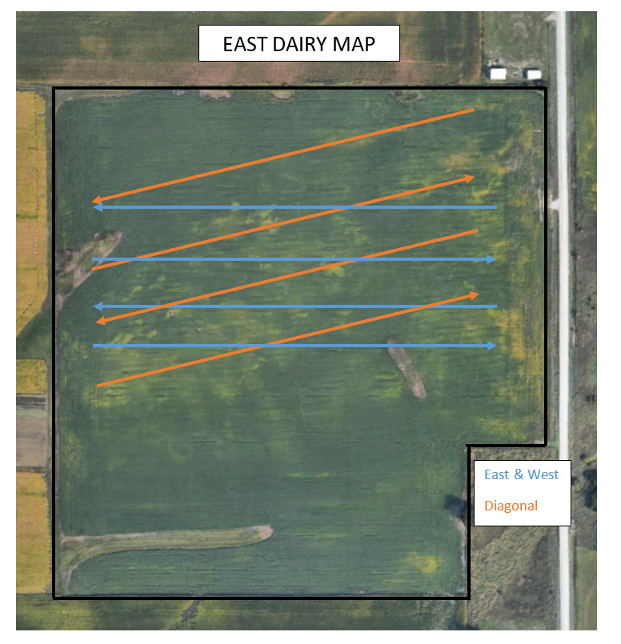
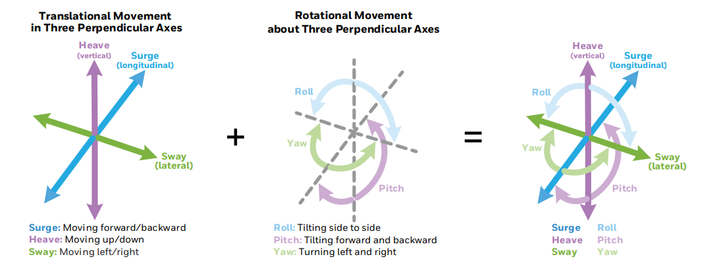
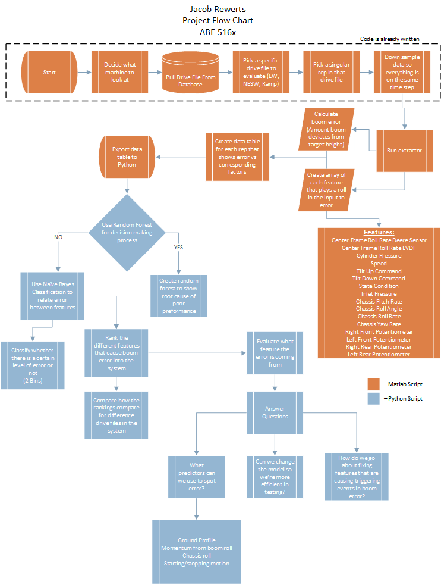

## Making a Project Website

### About

My name is Jake and I am a graduate student studying off-highway equipment.

### Introduction to a research question (what is the background on this subject; why does the question matter; who will it help; how has been attempted to be answered)

My goal is to find what causes error in the stability of a boom by scrubbing through data of field running.

What kind of data is avialble?  How is your data collected?  Are there any concerns about the data?  Which data is the most relevant?  Is the data easy to acccess? Will the data change over time?  What needs to be done to the data to get it ready for any downstream analysis?

#### Paragraph on what my research is about and what I want to solve

* Add picture of field we are testing

  

* Add picture of boom desciritpion (POS Presentation YAW roll pitch)

Figure 1: TARS Translational Motion Source: Honeywell

### Data Analysis Questions

1. What predictors can we use to spot error in the system while in field conditions?
2. Can we somehow change the model we currently use so we are more efficient in testing? e.g. remove insignificant variables
3. How do we go about fixing features that are triggering events in boom unstability and error?

#### Clear identification of data inputs

* Feature list with descriptions

## Features

__Center Frame Roll Rate Deere Sensor__ - Description of center frame roll rate using IMU

__Center Frame Roll Rate LVDT__ - A linear variable differential transformer reports the roll angle of the center frame in deg/sec

__Cylinder Pressure__ - Max pressure of the tilt cylinders at a given time

__Speed__ - Speed of the self propelled sprayer in km/h

__Tilt Up Command__ - Speed commanded to raise the boom of the sprayer by the tilt cylidners deg/sec

__Tilt Down Command__ - Speed commanded to lower the boom of the sprayer by the tilt cylidners deg/sec

__State Condition__ - Whether the machine is starting/stopping, state 0, or running in the field, state 1

__Inlet Pressure__ - System pressure of the machine

__Chassis Pitch Rate__ - Rate at which the chassis of the self propelled sprayer pitches

__Chassis Roll Angle__ - Angle at which the chassis of the self propelled sprayer rolls

__Chassis Roll Rate__ - Rate at whcih the chassis of the self propelled sprayer rolls

__Chassis Yaw Rate__ - Rate at whcih the chassis of the self propelled sprayer experiences yaw

__Right Front Potentiometer__ - Linear distance the right front tire strokes in and out from the chassis

__Left Front Potentiometer__ - Linear distance the left front tire strokes in and out from the chassis

__Right Rear Potentiometer__ - Linear distance the right rear tire strokes in and out from the chassis

__Left Rear Potentiometer__ - Linear distance the left rear tire strokes in and out from the chassis

## Analysis Methods

### Project Workflow

Project Workflow:

Figure 2: Project Workflow

### Matlab

* Add picture of matlab scripting

* Add picture of DownSample

* Add picture of if loop

* Add picture of if loop for Error (description)

* Add picture of data table

### Python

* Pulling in dataset

* Heat Map correlation

* From heat map, this is a jointplot I created

* creating statistcal methods

*Create Random forest machine learning test dataset and training dataset

* Ranked decisions with explanation

*Features IMportance - Condition

* Decision Tree Picture from website

* Add if we take away speed condition with mask

* Add how I masked it

### Pros and Cons of using Random Forest/Decison Tree

### Paragraph on topics below

Incorporation of topics relevant to this class  - what from the class did you use in this project and why might it be useful for research projects like this?  What are the advantages and disadvantages?  Were there any assumptions or transformations needed?

### Repeatability

Ability to automate and reproduce your analysis (if the file input were to change, could this analysis be reproduced and how easily?)  - how will someone else reproduce this analysis?  Is the data stored somewhere?  Can I reproduce the figures easily?

* Add links to python and matlab script
* How do I automate this analysis
* Add steps

#### Other things to consider:

* Inclusion of statistical tools

* Publication of workflow in a version controlled manner (your code should be on github)

### Data Analysis Questions - Answered

Q. What predictors can we use to spot error in the system while in field conditions?

A. fdd

Q. Can we somehow change the model we currently use so we are more efficient in testing? e.g. remove insignificant variables

A. fdkf

Q. How do we go about fixing features that are triggering events in boom unstability and error?

A. fdfkd

### Task for Class

* Task about CSV of Ramp and creating Decision Tree. How does this relate to the E-W runs
