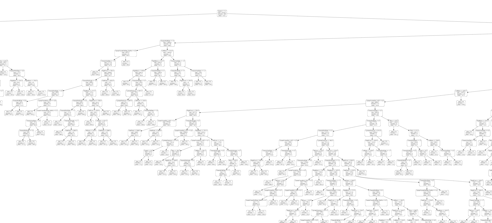
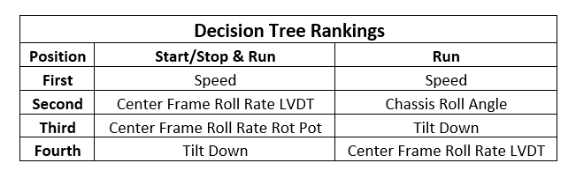

## Boom Height Error Evaluation

### About

My name is Jake Rewerts and I am a graduate student studying advanced machinery engineering and manufactoring systems at Iowa State. I am studying underneath Dr. Darr and my research involves hydraulic component analysis on self propelled sprayers.

  

## Project Scope

### Introduction

My goal is to find what causes error in the stability of a boom by scrubbing through data of field running. Self propelled sprayers are used to apply chemicals to fields that are used for row crops or pastures. When the sprayer is being driven across the field, different terrains can cause the boom to move off target height. This can cause spray drift and/or enadequate coverage of chemicals. My hope is too look at data aquired from different sensors on the sprayer to identify points where boom height performance can be approved. 

  

### Field Running

The data is collected using a data aquisition system on the sprayer and stored in a local repository for reference. Axiomatics, CAN bus, tars sensors, linear and rotational potentiometers, ultrasonic sensors, and pressure sensors were all used to aquire signals from the machine.

  

### Boom and Chassis Characteristics

  

\*Source: [HoneyWell TARS IMU](https://sensing.honeywell.com/honeywell-sensing-tars-imu-datasheet-000828.pdf)

### Data Analysis Questions

1. What predictors can we use to spot error in the system while in field conditions?
2. Can we somehow change the model we currently use so we are more efficient in testing? e.g. remove insignificant variables
3. How do we go about fixing features that are triggering events in boom unstability and error?

### Features to be Evaluated

__Center Frame Roll Rate Rotational Potentiometer__ - Description of center frame roll rate using a rotational potentiometer deg/sec

__Center Frame Roll Rate LVDT__ - A linear variable differential transformer reports the roll angle of the center frame in deg/sec

__Cylinder Pressure__ - Max pressure of the tilt cylinders at a given time psi

__Speed__ - Speed of the self propelled sprayer in km/h

__Tilt Up Command__ - Speed commanded to raise the boom of the sprayer by the tilt cylidners deg/sec

__Tilt Down Command__ - Speed commanded to lower the boom of the sprayer by the tilt cylidners deg/sec

__State Condition__ - Whether the machine is starting/stopping, state 0, or running in the field, state 1

__Inlet Pressure__ - System pressure of the machine

__Chassis Pitch Rate__ - Rate at which the chassis of the self propelled sprayer pitches

__Chassis Roll Angle__ - Angle at which the chassis of the self propelled sprayer rolls

__Chassis Roll Rate__ - Rate at whcih the chassis of the self propelled sprayer rolls

__Chassis Yaw Rate__ - Rate at whcih the chassis of the self propelled sprayer experiences yaw

__Right Front Potentiometer__ - Linear distance the right front tire strokes in and out from the chassis

__Left Front Potentiometer__ - Linear distance the left front tire strokes in and out from the chassis

__Right Rear Potentiometer__ - Linear distance the right rear tire strokes in and out from the chassis

__Left Rear Potentiometer__ - Linear distance the left rear tire strokes in and out from the chassis

## Analysis Methods

### Project Workflow

  

### Matlab

Each drive file is associated with MetaData that allows us to easily organize the different runs and pull out certain information.

  

The data is downsampled to a constant timestep using an already created function that will align all signals with the same 25 Hz time step. This will make things easier to plot because all the arrays will be the same size.

  

The IF loop allows us to only run the drive files we want, while also pulling max error from the sensors. Max error is the difference of the commanded boom target height and the actual boom height from the outermost signal. We will be looking at max error as our identifier throughout the project.

  

Once all the signals are extracted to the appropiate array, we put them into a data table. The *Writeable* command in Matlab will pull the created Data Table into an exported CSV file we can move over to Python for further data analysis.

  

  

### Python

The CSV file created in Matlab is copied into the same folder as our Python script and placed into a Pandas table.

  

From the scatter plot we can see that there are error differences between the two sepearte conditions we notice in a field run, Starting/Stopping and Normal Running. 

  

We created a mask to sepearte these difference conditions so we can better monitor its effect on error.

  

Two heat maps are made from the correlation the different features have with each other. One heat map represents a combinded dataset of both Starting/Stopping and Normal Field Running while the other just evaluates correlation in normal field running.

   

  

To evaluate this model we created a Random forest to see what the best predictors are when trying to decide "what causes error".
Our 16 different features are used as our data inputs and our Max Error is what we are predicting. By creating both a training dataset and a testing dataset, we will be able to see how accurately our model predicted the error.

  

Afer creating two different random forests, we can see which features are the most important in each of the two models. The features that were important stayed similar on both models, but the percent of importance was changed significantly.

   

  

Using [WebGraphViz.com](http://www.webgraphviz.com/) we are able to create a Decision Tree based off of the array created from our Random Forest. The rankings of the most important factors can be used to see what values have the greatest impact on Machine Error when looking at ways to improve the sprayer system.

  

\*Decision Tree was too spread out for photo representation difference

  

  
## Conclusion

I decided random forest would be the best machine learning method for my project because it would be able to rank my results of the impact each feature had on boom error stability. From the course in general though, this project would not have been possible wihtout the knowledge we recieved about data wrangling and data scrubbing. The data from the sensors was noisy and had different sample rates, so being able to "clean" that data before use was crucial in being able to understand it.

### Pros and Cons of using Random Forest/Decison Tree

Pros - 
  * small number of samples
  * compuational cost is low
  
Cons - 
  * More samples will not improve accuracy to a certain point
  * Gets beat by more complicated neural networks that benefit from large samples
  
### Repeatability

To repeat this project, you will first need to select a .mat file that has already been created and stored in the local respository. If that is in the same folder as your Matlab Call Script, it will create a CSV file you can extract to Python. The only thin you will need to do is copy the CSV file from your Matlab folder, to your Python folder.

* Matlab [Code](Matlab/Project_516_TableCreator.m)
* Python [Code](Python/Jake's%20Project.ipynb)

### Statistical tools

  

These values seem to make sense because they are the statistical differences between the model and training data. One may think that 5000 is a large value for a statistical metric but the units are mm.^2. i.e. 25.4 mm = 1 in and the modeled data.

### Data Analysis Questions - Answered

**Q.** What predictors can we use to spot error in the system while in field conditions?

**A.** From running both the models it is clear that the most important feautre is Speed, the faster you go, the more error you enduce into the system. This makes sense because as speed increase, so does the momentum of your sprayer which will make impacts "harder". Other important features were Center Frame Roll and Chassis Roll Angle. These are important to take into account because there are finite systems on the machine where we can take a deeper look into what can be changed to lower roll angle or roll rate.

**Q.** Can we somehow change the model we currently use so we are more efficient in testing? e.g. remove insignificant variables

**A.** From this project, it appears that potentiometers on the wheels themselves have little to no effect on the error we are encountering. Changes in the position of these wheels do not seem to drive a significant impact in the error. This could be accounted for the error being created by the moving wheels being put into another system like the chassis or susspension.

**Q.** How do we go about fixing features that are triggering events in boom unstability and error?

**A.** To fix feautres like Center Frame Roll Rate or Chassis Roll Angle you will need to dive deeper into a component analysis of each system. For example, my research is self propelled sprayer component analysis of fluid power hydrauilcs for boom height contorl. That research may provide an avenue into answers related to center frame control.

### Task for Class

Using the same approach used for finding correlation and feature importance in boom error during an east-west run, use the given CSV file to create a random forest and decision tree for a ramp run and complete an error evaluation. [Code](Python/DataTableField_5Ramp.csv)
