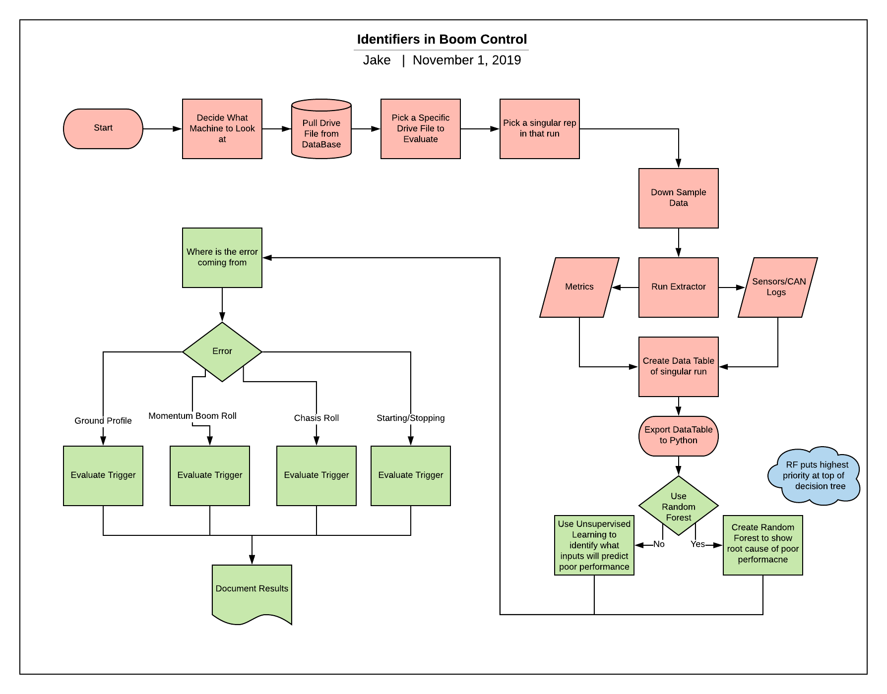

## Making a Project Website

### About

My name is Jake and I am a graduate student studying off-highway equipment.

### Introduction to a research question (what is the background on this subject; why does the question matter; who will it help; how has been attempted to be answered)

My goal is to find what causes error in the stability of a boom by scrubbing through data of field running.

#### Clear data analysis question 

### Project Workflow

Project Workflow:

#### Clear identification of data inputs

*Explanation of Work flow

#### Clear identification of analysis methods (workflows would be great here) and their advantages and disadvantages 

Specifically, I would like to see a written discussion on the website of the following:

#### Incorporation of topics relevant to this class  - what from the class did you use in this project and why might it be useful for research projects like this?  What are the advantages and disadvantages?  Were there any assumptions or transformations needed?

### Objectives
Why is there error?

#### Ability to automate and reproduce your analysis (if the file input were to change, could this analysis be reproduced and how easily?)  - how will someone else reproduce this analysis?  Is the data stored somewhere?  Can I reproduce the figures easily?

* How do I automate this analysis
* Add steps

## Questions for Website from Canvas

#### Creation of one assignment based on your dataset for the class to complete - one can think of this of a task or homework assignment based on your project. (TASK)

#### Other things I will look for:

* Inclusion of statistical tools

* Publication of workflow in a version controlled manner (your code should be on github)

* What did you learn and do the results make sense?  Revisit your initial question and answer it.  H

## Suggestions for Project Reporting

### Interesting question 

What is the scientitifc goal?  What would you do if you had all the data?  What do you want to predict or estimate?  Why is this relevant to ABE researchers or the field?  Provide some background on the rationale and relevance.

### Data description

What kind of data is avialble?  How is your data collected?  Are there any concerns about the data?  Which data is the most relevant?  Is the data easy to acccess? Will the data change over time?  What needs to be done to the data to get it ready for any downstream analysis?

### Explore the data

Demonstrate what you would do to describe the data and if it has any patterns or anomolies.  Make some plots.

### Model the data

Build a model, fit the model, validate the model.

### Communciate and visualize the results

