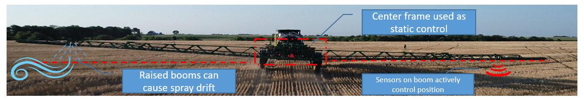

## Making a Project Website

### About

My name is Jake Rewerts and I am a graduate student studying advanced machinery engineering and manufactoring systems at Iowa State. I am studying underneath Dr. Darr and my research involves hydraulic component analysis on self propelled sprayers.

## Project Scope

### Introduction

My goal is to find what causes error in the stability of a boom by scrubbing through data of field running. Self propelled sprayers are used to apply chemicals to fields that are used for row crops or pastures. When the sprayer is being driven across the field, different terains can cause the boom to move off of target height. This can cause spray drift and/or enadequate coverage of chemicals. My hope is too look at data aquired from different sensors on the sprayer to identify points where boom height performance can be approved. 

  

### Field Running

The data is collected using a data aquisition system on the sprayer and stored in a local repository for reference. Axiomatics, CAN bus, tars, potentiometer, ultrasonic, and pressure sensors were all used to aquire signals

  

### Boom and Chassis Characteristics

  

Source: Honeywell TARS Translational Motion

### Data Analysis Questions

1. What predictors can we use to spot error in the system while in field conditions?
2. Can we somehow change the model we currently use so we are more efficient in testing? e.g. remove insignificant variables
3. How do we go about fixing features that are triggering events in boom unstability and error?

### Features to be Evaluated

__Center Frame Roll Rate Rotational Potentiometer__ - Description of center frame roll rate using a Rotational Potentiometer

__Center Frame Roll Rate LVDT__ - A linear variable differential transformer reports the roll angle of the center frame in deg/sec

__Cylinder Pressure__ - Max pressure of the tilt cylinders at a given time

__Speed__ - Speed of the self propelled sprayer in km/h

__Tilt Up Command__ - Speed commanded to raise the boom of the sprayer by the tilt cylidners deg/sec

__Tilt Down Command__ - Speed commanded to lower the boom of the sprayer by the tilt cylidners deg/sec

__State Condition__ - Whether the machine is starting/stopping, state 0, or running in the field, state 1

__Inlet Pressure__ - System pressure of the machine

__Chassis Pitch Rate__ - Rate at which the chassis of the self propelled sprayer pitches

__Chassis Roll Angle__ - Angle at which the chassis of the self propelled sprayer rolls

__Chassis Roll Rate__ - Rate at whcih the chassis of the self propelled sprayer rolls

__Chassis Yaw Rate__ - Rate at whcih the chassis of the self propelled sprayer experiences yaw

__Right Front Potentiometer__ - Linear distance the right front tire strokes in and out from the chassis

__Left Front Potentiometer__ - Linear distance the left front tire strokes in and out from the chassis

__Right Rear Potentiometer__ - Linear distance the right rear tire strokes in and out from the chassis

__Left Rear Potentiometer__ - Linear distance the left rear tire strokes in and out from the chassis

## Analysis Methods

### Project Workflow

Project Workflow

### Matlab

Each drive file is associated with MetaData that allows us to easily organize the different runs and pull out certain information.

  

The data is downsampled to a constant timestep using a created function that will create all signals with the same 25 Hz time step. This will make things easier to plot because they will all be the same size.

  

The IF loop allows us to only run the drive files we want, while also pulling max error from the sensors. Max error is the difference of the commanded boom target height and the actual boom height from the outermost signal.

  

Once all the signals are extracted to the appropiate array, we put them into a data table to be exported to Python.

  

  

### Python

* Pulling in dataset

  

* Create Scatter

  

* Create Mask

  

* Heat Map correlation

   

* From heat map, this is a jointplot I created

* creating statistcal methods

*Create Random forest machine learning test dataset and training dataset

  

* Ranked decisions with explanation

* Features IMportance - Condition

   

* Decision Tree Picture from website

* Add if we take away speed condition with mask

* Add how I masked it

### Pros and Cons of using Random Forest/Decison Tree

### Paragraph on topics below

Incorporation of topics relevant to this class  - what from the class did you use in this project and why might it be useful for research projects like this?  What are the advantages and disadvantages?  Were there any assumptions or transformations needed?

### Repeatability

Ability to automate and reproduce your analysis (if the file input were to change, could this analysis be reproduced and how easily?)  - how will someone else reproduce this analysis?  Is the data stored somewhere?  Can I reproduce the figures easily?

* Add links to python and matlab script
* How do I automate this analysis
* Add steps

#### Other things to consider:

* Inclusion of statistical tools

  

* Publication of workflow in a version controlled manner (your code should be on github)

### Data Analysis Questions - Answered

Q. What predictors can we use to spot error in the system while in field conditions?

A. fdd

Q. Can we somehow change the model we currently use so we are more efficient in testing? e.g. remove insignificant variables

A. fdkf

Q. How do we go about fixing features that are triggering events in boom unstability and error?

A. fdfkd

### Task for Class

* Task about CSV of Ramp and creating Decision Tree. How does this relate to the E-W runs
